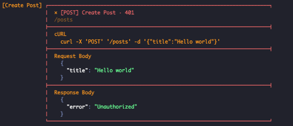
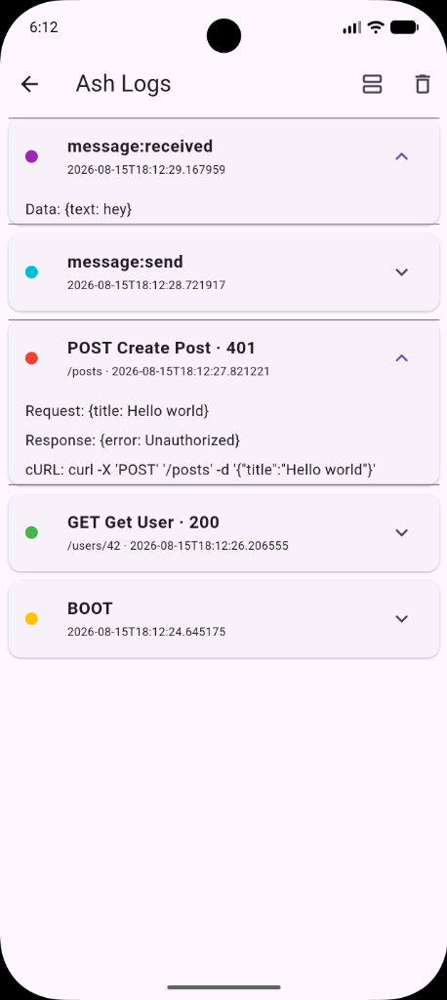

# ash_logger

A colorful, Postman/Swagger-style debug logger for Flutter.

Debug prints, API success/error, cURL commands, and socket in/out logs —
printed as clean bordered boxes with syntax-highlighted JSON. Every field
on every call is **optional**: log just an endpoint, or a full
method + curl + request + response breakdown. Nothing runs in release
builds unless you turn it on.

```
┌────────────────────────────────────────────────────────────────────┐
│  ● [POST] Create Post · 401
│  /posts
├────────────────────────────────────────────────────────────────────┤
│  cURL
│    curl -X 'POST' '/posts' -d '{"title":"Hello world"}'
├────────────────────────────────────────────────────────────────────┤
│  Request Body
│    { "title": "Hello world" }
├────────────────────────────────────────────────────────────────────┤
│  Response Body
│    { "error": "Unauthorized" }
└────────────────────────────────────────────────────────────────────┘
```


<br/>


## Features

- `AshLog.trace` / `debug` / `success` / `error` / `fatal` — plain colored logs.
  `error`/`fatal` accept an `error` object and `stackTrace`, each printed as
  its own section.
- `AshLog.network` — GET/POST/etc. request+response logging, every field optional.
- `AshLog.curl` — standalone cURL command formatter.
- `AshLog.socketOn` / `AshLog.socketEmit` — socket traffic in magenta/cyan.
- **Levels** (`AshLevel`: trace → fatal) with a runtime floor —
  `AshLog.level = AshLevel.warning` mutes noisy logs without deleting the
  call sites.
- **Pluggable filter** (`AshLogFilter`) — write your own rule (sampling, muting
  a tag/endpoint) and pass it to `AshLog.init(filter: ...)`.
- **Pluggable outputs** (`AshLogOutput`) — not just console. Ships
  `ConsoleAshLogOutput` (default) and `AshLogStreamOutput` so you can forward
  entries to Crashlytics/Sentry/your own listener alongside printing them.
- Fully themeable (`AshLogTheme`): colors, box width, boxed vs. minimal style.
- Bounded in-memory history (circular buffer) — no memory leaks over a long session.
- Optional `AshLogViewer` widget — an in-app, Swagger-style log list you can flip
  between vertical and horizontal layouts.
- No-op automatically in release mode; works on iOS, Android, web, macOS, Windows, Linux.
- Clean-architecture internals (`domain` / `data` / `formatters` / `filter` /
  `output` / `presentation`) so you can swap any layer without touching the
  public API.

## Getting started

```yaml
dependencies:
  ash_logger: ^0.1.0
```

```dart
import 'package:ash_logger/ash_logger.dart';

void main() {
  AshLog.init(); // optional, sane defaults
  runApp(const MyApp());
}
```

## Usage

```dart
// Plain debug
AshLog.debug('User tapped checkout', tag: 'UI');

// Network — nothing is mandatory
AshLog.network(endpoint: '/users/42'); // quick GET trace

AshLog.network(
  method: 'POST',
  endpoint: '/posts',
  requestBody: {'title': 'Hello world'},
  responseBody: {'id': 1},
  statusCode: 201,
  curl: "curl -X 'POST' '/posts' -d '...'",
  title: 'Create Post',
);

// Sockets
AshLog.socketEmit(event: 'message:send', data: {'text': 'hi'});
AshLog.socketOn(event: 'message:received', data: {'text': 'hey'});

// Errors with stack traces
try {
  await api.submit();
} catch (e, st) {
  AshLog.error('Submit failed', title: 'Checkout', error: e, stackTrace: st);
}
```

### Levels

```dart
// Mute everything below warning at runtime — no need to remove log calls.
AshLog.level = AshLevel.warning;

// Or set the floor once at init:
AshLog.init(config: const AshLogConfig(level: AshLevel.info));
```

### Custom filter and outputs

```dart
class MuteHealthCheck implements AshLogFilter {
  @override
  bool shouldLog(AshLogEntry entry) => entry.endpoint != '/health';
}

final streamOutput = AshLogStreamOutput();
AshLog.init(
  filter: MuteHealthCheck(),
  outputs: [const ConsoleAshLogOutput(), streamOutput],
);

// Forward errors to your crash reporter of choice:
streamOutput.stream
    .where((e) => e.level == AshLevel.error || e.level == AshLevel.fatal)
    .listen((e) => MyCrashReporter.record(e.message, e.errorObject, e.stackTrace));
```

### Custom theme

```dart
AshLog.init(
  config: AshLogConfig(
    maxInMemoryLogs: 300,
    theme: const AshLogTheme(
      style: AshLogStyle.minimal, // or AshLogStyle.boxed
      successColor: Ansi.green,
      errorColor: Ansi.red,
    ),
  ),
);
```

### In-app viewer

```dart
Navigator.push(context, MaterialPageRoute(
  builder: (_) => const AshLogViewer(scrollDirection: Axis.vertical),
));
```

## Project Structure

This package follows Clean Architecture principles, making it highly modular and easy to extend:

```text
lib/
├── ash_logger.dart         # Public API (AshLog)
└── src/
    ├── ash_log.dart        # Entry point and static methods
    ├── config/             # Theme and configuration models
    ├── core/               # Enums (AshLevel, AshLogType, ANSI colors)
    ├── data/               # Repositories (InMemoryAshLogRepository)
    ├── domain/             # Entities (AshLogEntry, AshLogRepository interface)
    ├── filter/             # Logging rules (AshLogFilter)
    ├── formatters/         # UI rendering (ConsoleFormatter, JsonColorizer)
    ├── output/             # Sinks (ConsoleAshLogOutput, AshLogStreamOutput)
    └── presentation/       # UI Widgets (AshLogViewer)
```

## Roadmap

This package is intentionally structured (domain/data/formatters/presentation)
so new capabilities can be added as independent pieces: file/remote log
export, a floating overlay bubble, Dio/http interceptors, log filtering
in the viewer, and more themes.

## Contributing

Issues and PRs welcome at the GitHub repo.
# ash-logger
